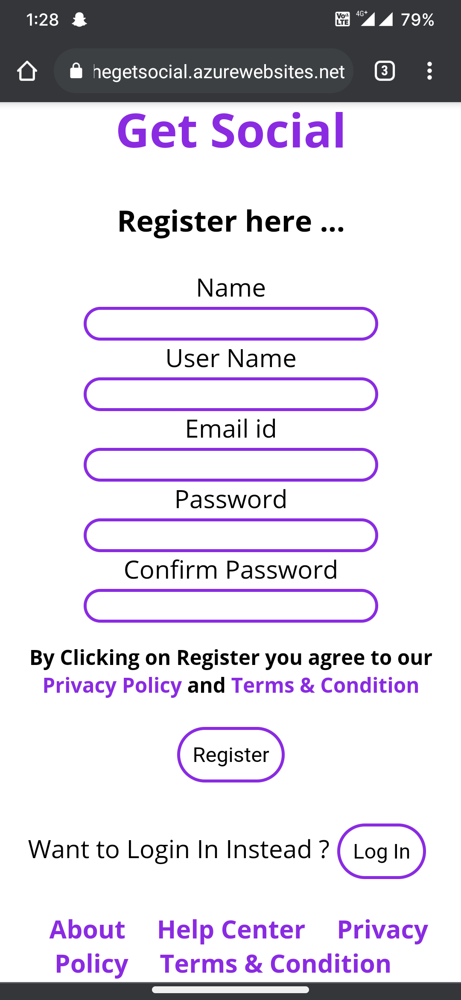
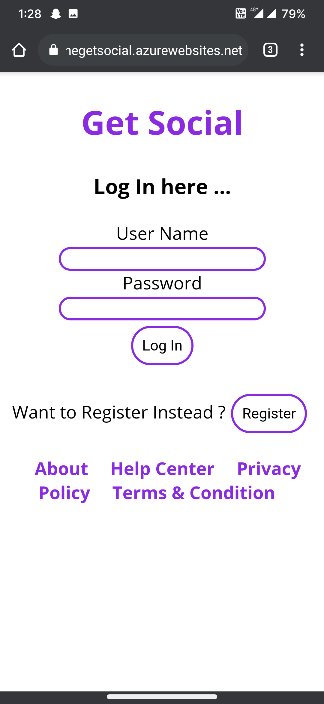

# GetSocial
 

A new Social Media App made to respect the Privacy of Users.

https://thegetsocial.azurewebsites.net/

## Ui
 ,  ,   

## Tech Used

 <b>Frontend</b> : React , HTML , CSS , Js 

 <b>Backend</b> : Node Js

 <b>Db</b> : MongoDb (Cluster0 : Mumbai SouthAsia1) 

 <b>Deployment</b> : Azure 

## Current Features
<ul>
  <li>Post Something</li>
  <li>See Post from your friends</li>
  <li>Search a User / Friend</li>
  <li>Send an invitation to your friend</li>
</ul>

## Features to be added
<ul>
 <li>Profile card</li>
 <li> Integrating React router </li>
 <li>Block / Unblock a User</li>
 <li>Like / Retweet a post</li>
 <li>Sign in with third party platform like Google , Twitter </li>
</ul>
